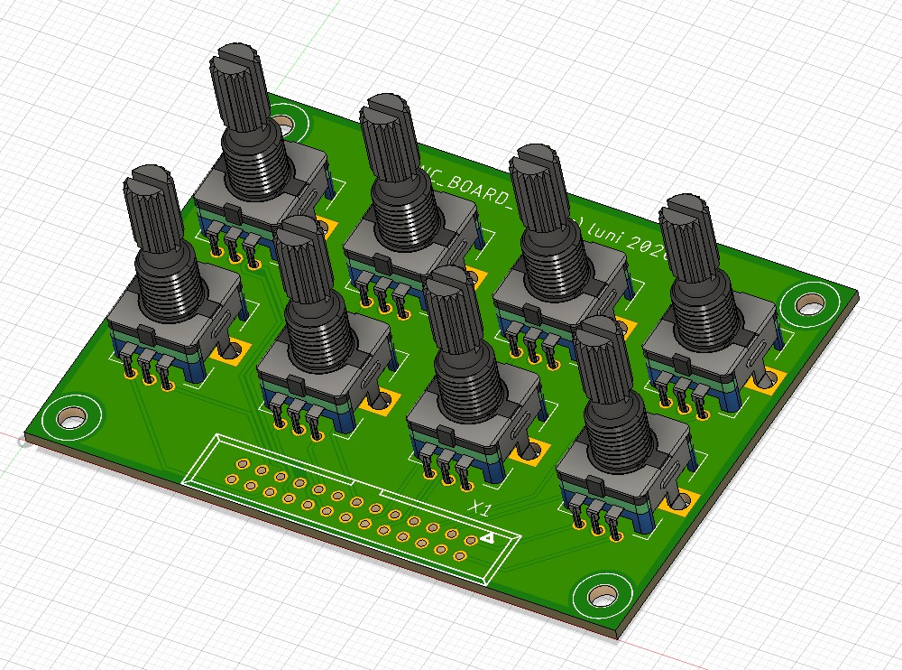

# EncPlex
EncPlex is a small Arduino library for reading **rotary encoders**. It works with encoders **connected directly** to digital pins and with encoders **connected via a multiplexer**. Unlike most other libraries, EncPlex uses a **polling algorithm** that generates a predictable processor load and is completely **insensitive to contact bounce**.

**Contents**
<!-- vscode-markdown-toc -->
* [Extras](#Extras)
* [Prerequisites](#Prerequisites)
* [Usage of the Library](#UsageoftheLibrary)
	* [Directly Connected Encoders](#DirectlyConnectedEncoders)
	* [Array of Encoders](#ArrayofEncoders)
	* [Multiplexed Encoders](#MultiplexedEncoders)
		* [Using Shift Registers 74HC165](#UsingShiftRegisters74HC165)
		* [Using the A/D MUX Breakout CD74HC4067](#UsingtheADMUXBreakoutCD74HC4067)
	* [Callbacks](#Callbacks)
* [How does it Work](#HowdoesitWork)

<!-- vscode-markdown-toc-config
	numbering=false
	autoSave=true
	/vscode-markdown-toc-config -->
<!-- /vscode-markdown-toc -->

## <a name='Extras'></a>Hardware

The extras folder of this repo contains [detailed information](extras/README.md) and production files for a test board to try out encoder multiplexing with 74165 shift registers. 


It also contains information about using the readily available CD4067 breakout boards. Here an example of a compact assembly using two SparkFun BOB-09056. (https://www.sparkfun.com/products/9056)


Finally, there is information and production files for a  8 rotary encoder test board.




## <a name='Prerequisites'></a>Prerequisites
EncPlex is written for the [ARM based PJRC Teensy boards](https://www.pjrc.com/teensy/) T-LC and T3.0 - T4.0. It is mainly aimed at manually operated, mechanical encoders, but also works with motor-driven optical encoders. However, for high speed encoders specialized libraries like the QUAD-Encoder-Library from mjs513 (https://github.com/mjs513/Teensy-4.x-Quad-Encoder-Library) might be a better choice.


## <a name='UsageoftheLibrary'></a>Usage of the Library

### <a name='DirectlyConnectedEncoders'></a>Directly Connected Encoders

Let's start with the standard situation of directly connected encoders. Lets assume that we have one encoder connected on pin 0 and 1. The following code shows how to set it up and display the current value if it changed:
```c++
#include "EncPlex.h"
using namespace libEncPlex;

Encoder encoder(0, 1);       // encoder connected at pins 0 and 1
int oldPos = 0;              // holds the last displayed position

void setup()                 // no setup required
{
}

void loop()
{
  encoder.tick();            // call tick as often as possible (usually 1-2kHz)

  int pos = encoder.read();  // get current value
  if (pos != oldPos)         // print if changed
  {
    Serial.print("pos: ");
    Serial.println(pos);
    oldPos = pos;
  }
}
```

### <a name='ArrayofEncoders'></a>Array of Encoders
In case you need to read out a lot of encoders it might be a good idea to use an encoder array to handle them.

```c++
#include "EncPlex.h"
using namespace PollingEncoder;

Encoder encoders[] = {{0,1}, {2,3}, {14,15}}; // 3 encoders on 0/1, 2/3 and 3/4
int oldPos[] = {0,0,0};

void tickAll()
{
   for(int i = 0; i < 3; i++)
   {
     encoders[i].tick();
   }
}

void setup()
{
   (new IntervalTimer)->begin(tickAll, 500); //2kHz, let an IntervalTimer do the tick work in the background...
}

void loop()
{
  for(int i = 0; i<3; i++)
  {
      int pos = encoders[i].read();
      if(pos != oldPos[i])
      {
        Serial.printf("Encoder: %d pos: %d\n",i, pos);
        oldPos[i] = pos;
      }
  }
}

```

### <a name='MultiplexedEncoders'></a>Multiplexed Encoders

If you have more encoders than free pins you can think of multiplexing them. EncPlex can be extended easily to support any multiplexer hardware you want to use. To demonstrate how that works, EncPlex contains two example classes. One handles multiplexing with two standard 8bit shift registers (74HC165), the other uses the readily available 16bit multiplexer CD74HC4067.

#### <a name='UsingShiftRegisters74HC165'></a>Using Shift Registers 74HC165

#### <a name='UsingtheADMUXBreakoutCD74HC4067'></a>Using the A/D MUX Breakout CD74HC4067

### <a name='Callbacks'></a>Callbacks


## <a name='HowdoesitWork'></a>How does it Work

Advantage: If you have a lot high speed or bouncy encoders, the generated interrupts can lead to a high and unpredictable load.

Erklärung