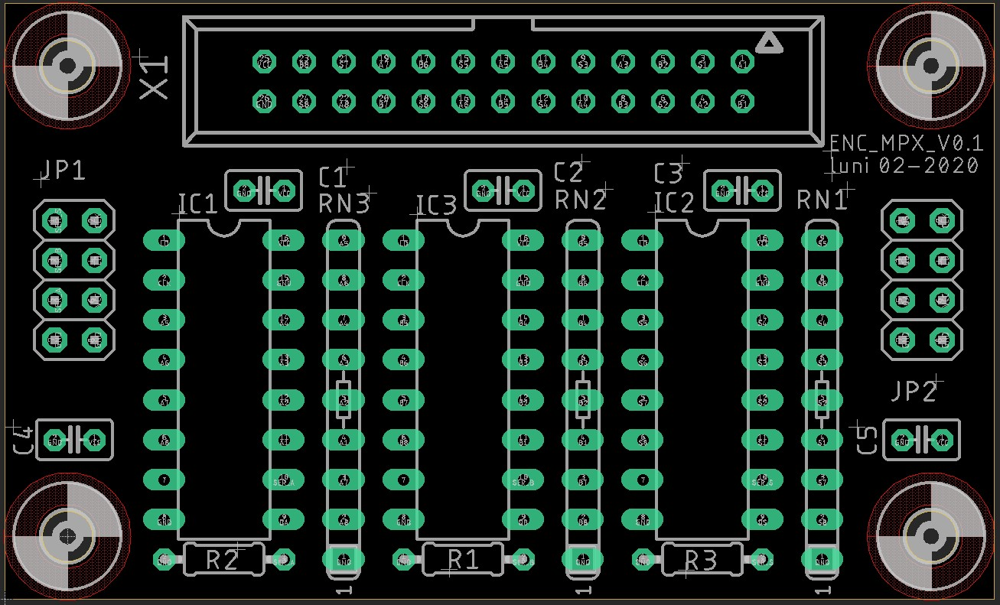
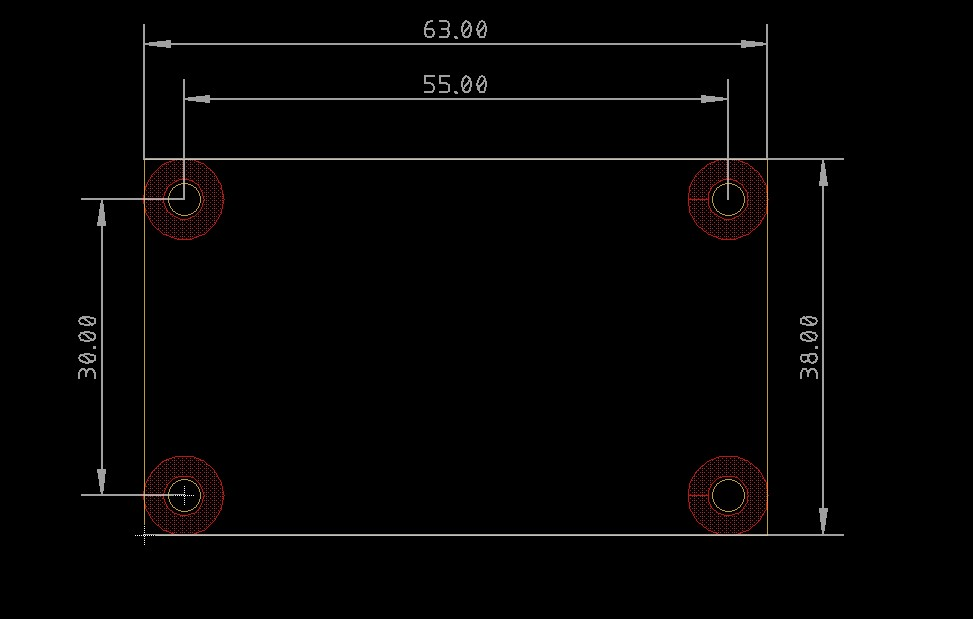

## Experimental Encoder Multiplexer

Multiplexer for 8 encoders with switches. The board can be daisy chained to handle more encoders.

Overview:

- Schematic: [ENC_MPX_V0.1.pdf](ENC_MPX_V0.1.pdf)
- Gerbers: [CAMOutputs.zip](CAMOutputs.zip)
- BOM: https://octopart.com/bom-tool/vhNEkctc  

Assembly: 

Dimensions 

