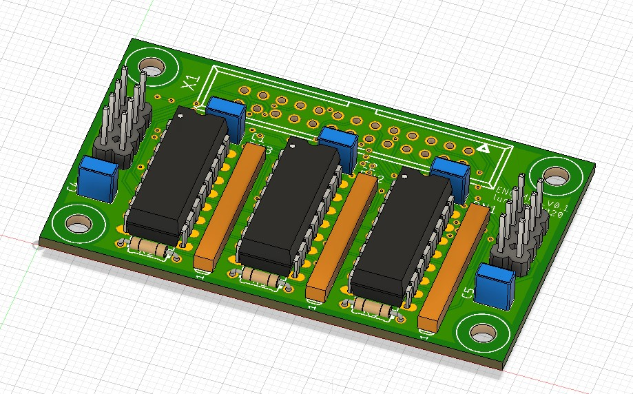
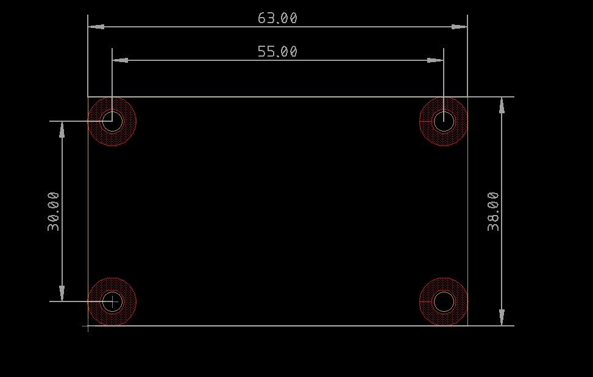
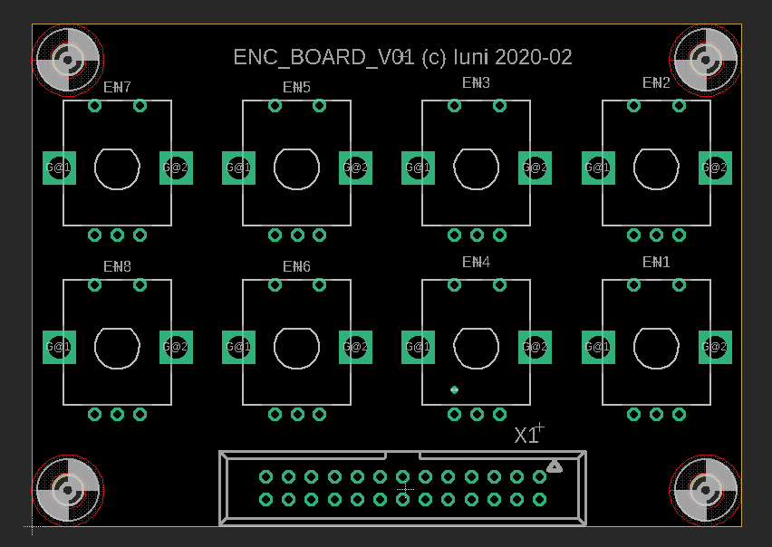
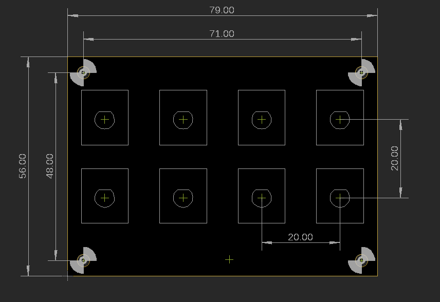

# Test Boards

The Eagle folder contains a test board using a 74HC165 as multiplexer and an encoder board for up to 8 rotary encoders with the usual 5mm pin pith.

## Encoder Multiplexer 74HC165

Multiplexer for 8 encoders with switches. The board can be daisy chained to handle more encoders.

Overview:

- Schematic: [ENC_MPX_V0.1.pdf](Eagle/ENC_MPX_V01/ENC_MPX_V0.1.pdf)
- Gerbers: [CAMOutputs.zip](Eagle/ENC_MPX_V01/CAMOutputs.zip)
- BOM: https://octopart.com/bom-tool/vhNEkctc

Assembly:

Dimensions

## Encoder Board

Test board for 8 encoders with switches.

Overview:

- Schematic: [ENC_BOARD_V0.1.pdf](Eagle/ENC_BOARD_V01/ENC_BOARD_V01.pdf)
- Gerbers: [CAMOutputs.zip](Eagle/ENC_BOARD_V01/CAMOutputs.zip)

Assembly:

Dimensions
